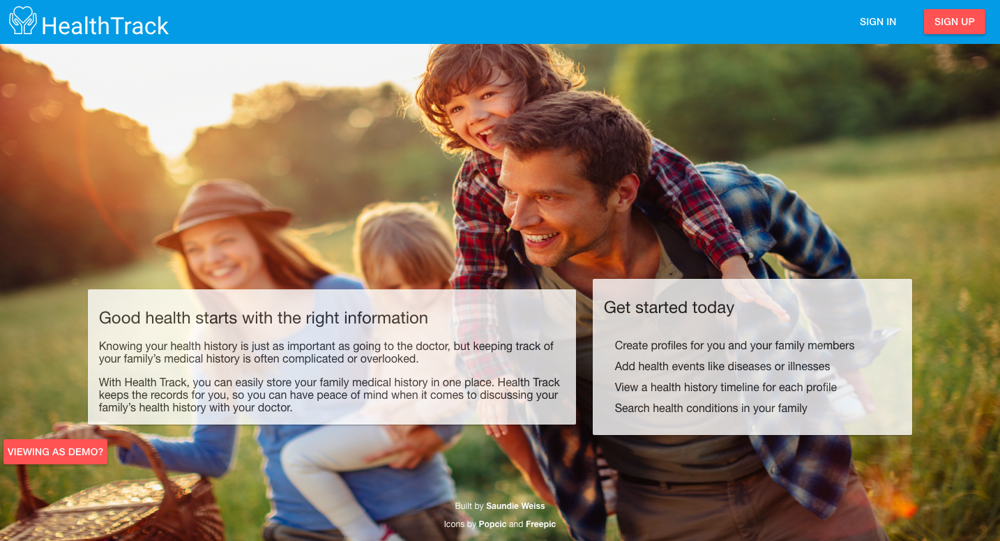

Every Galvanize Full Stack Immersive Program concludes with a final capstone project. The entire time we've been in the program, we've heard about this project and how important it is for us. My emotions before we started were nervous/anxious, but also super excited.

I wanted to choose a project that would be meaningful to me, but also something that other people could relate to and find useful. I chose to build a family medical history tracker. The purpose of my application is to help families keep track of their health history. It will help families have better conversations with each other and with their doctors about health history.

<h6>Overview</h6>

HealthTrack allows uses to set up their own health profiles and create profiles for each of their family members. Users can add family members, update their vitals (height, weight, blood type), and enter health events (surgeries, illness, injuries) for them.

Users are able to view a timeline of health events on their own profile as well as other family members. Timelines are also able to be filtered by age. Users can also search health conditions in their family to see which family members have certain illness or health issue.

<h6>The build</h6>

I built this project using Node and Express on the backend with Postgres for my database. On the frontend, I used Angular with the Angular Material Design library for a css framework. I really liked working with Angular Material Design Library and would like to learn more about Google Material Design. I definitely plan to use this in future applications. I'd really like HealthTrack to be a mobile application, and I think Material Design would make it look really sharp.

The hardest part of building this application was probably deciding how to structure it in the beginning. I had to make decisions about my database schema and set up all my routes. In hindsight, I could have set up my tables better. I think I could have combined more tables so that I would have fewer API calls (fewer services on the Angular side).

<h6>What's next</h6>

This was my largest application that I have built (although I plan to build more), and because of that, I know that I made decisions that could have been better. I need to do more form validation on the client side and alter some of my database schema so that it will not take in null values. These have caused issues (bugs) with my data.

I would like to add the height and weight data to the health time line so that users can see how that data changes and/or effects other health events. I would like to add more sorting features in the health timeline too.

One of the first features I'd like to work on for HealthTrack is to make it a responsive site. Unfortunately, it only looks good on a desktop. Stay tuned!

<h6>Check it out</h6>

Feel free to demo the application yourself. There are demo sign-in credentials on the homepage.

[Visit site](https://healthtrack.online)

[View code on Github](https://github.com/saundie184/health-track)

